style: style.css

--

### Magento модули:
- Галерея в списке товаров
- Аяксовый фасетный фильтр
- Исправление FPC (Full Page Cache), для переключения тем
- Настраиваемые метки на товары
- Расширение функционала отзывов
- Блок показа категорий

--

### Галерея в списке товаров
Позволяет просмотреть все изображения товара на странице категории, в открывающимся рядом списке.

--

--

--

--

--

--
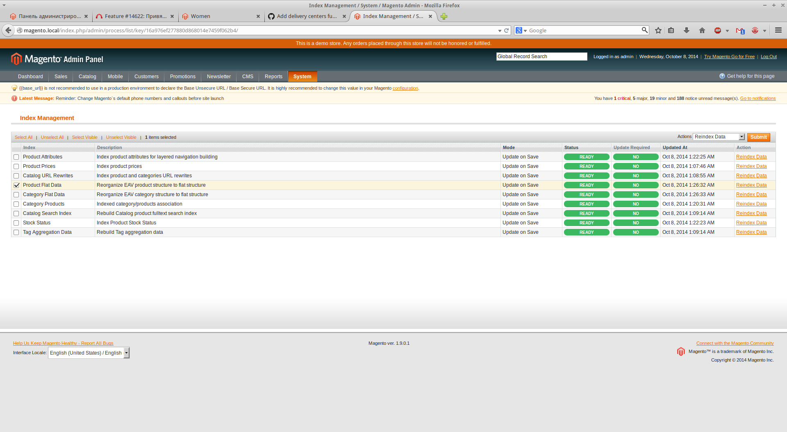
--

--

### Аяксовый фасетный фильтр
Расширяет стандартный поиск, делает его аяксовым и с возможностью множественного выбора.

--
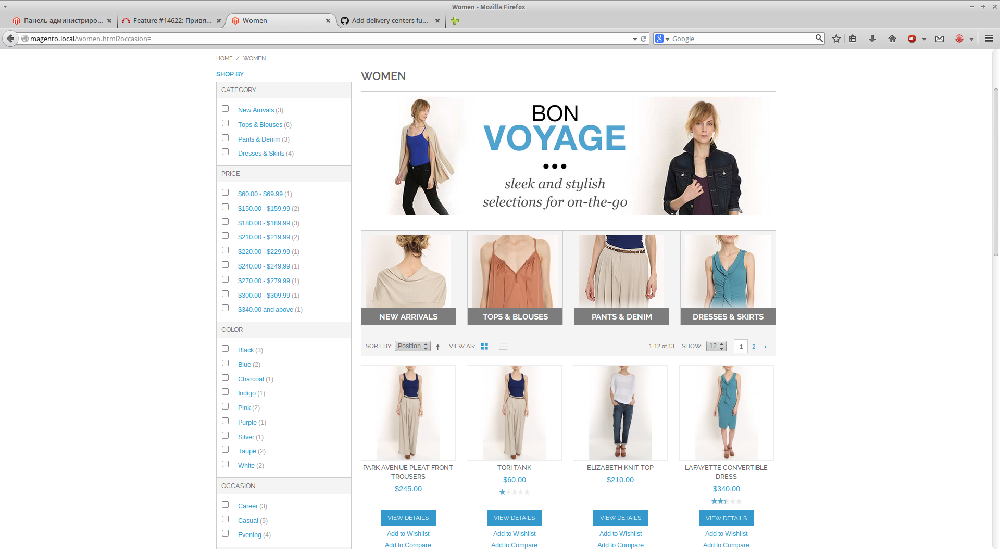
--

--
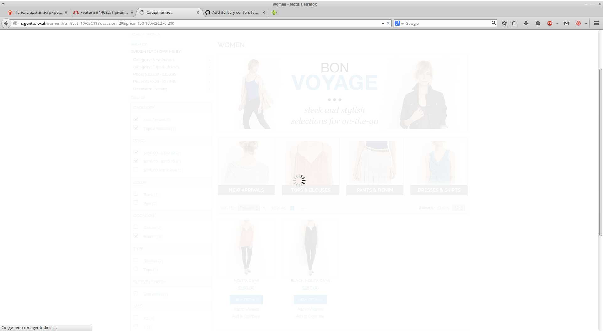
--

--

### Исправление FPC (Full Page Cache), для переключения тем
При включенном FPC, изначально, при переходе с десктопной версии сайта на мобильную (или наоборот), страницы кешировались и показывались всем. Данный модуль решает эту проблему.

--
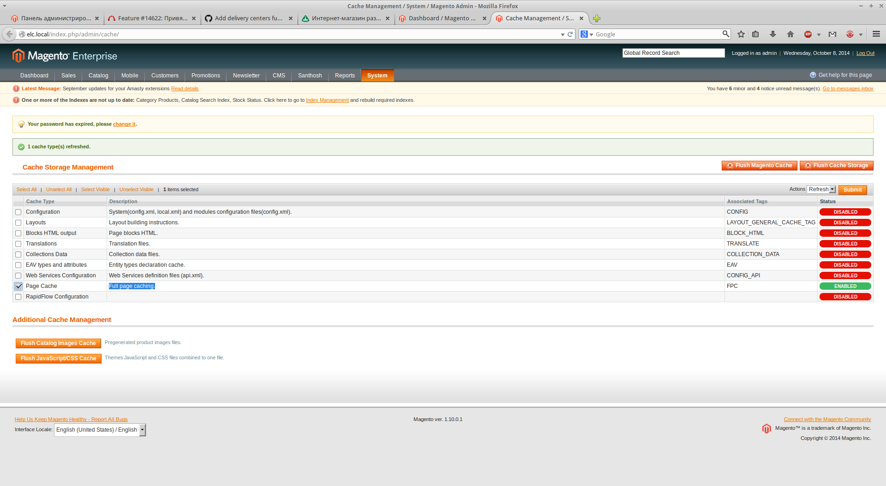
--

--

--

--

### Настраиваемые метки на товары
Данный модуль позволяет создавать метки для товаров. У меток есть возможность создавать и настраивать различные правила в конструкторе условий, по которым определяется, будет ли она показана.

--

--

--
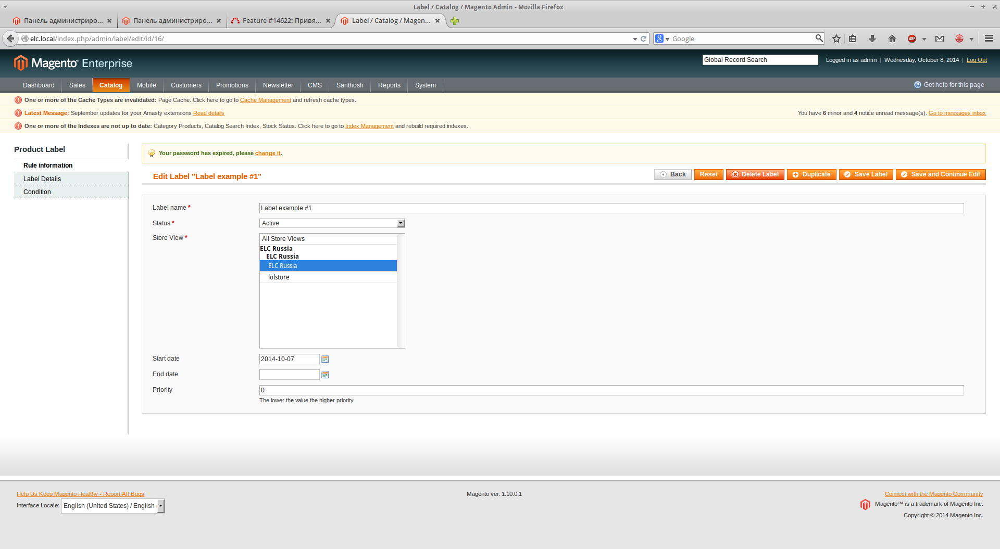
--

--
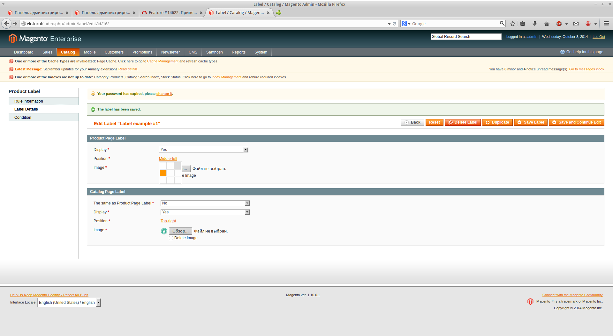
--
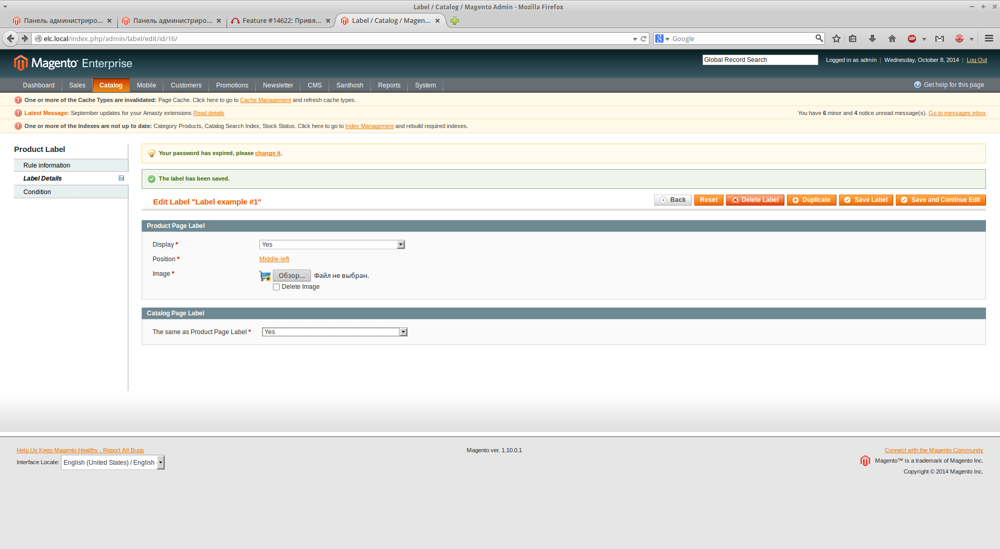
--

--

--

--

--

--

--

--

### Расширение функционала отзывов
Этот модуль делает следующие вещи:

--
<small>
- Добавляет поле email к сущности отзыва
- Добавляет возможность голосовать за отзывы (полезный или нет)
- Добавляет в таблицу отзывов в адмике колонки с email'ом, количеством плюсов и минусов
- Добавляет в админку таблицу оценок отзывов
- Позволяет настраивать минимальное время между отправкой отзывов
- Создает систему, для отправки покупателям на почту просьб оставить отзыв недавно приобретенным товарам, по заданным настройкам
 - 1
 - 2
</small>
--

--

--

--

--
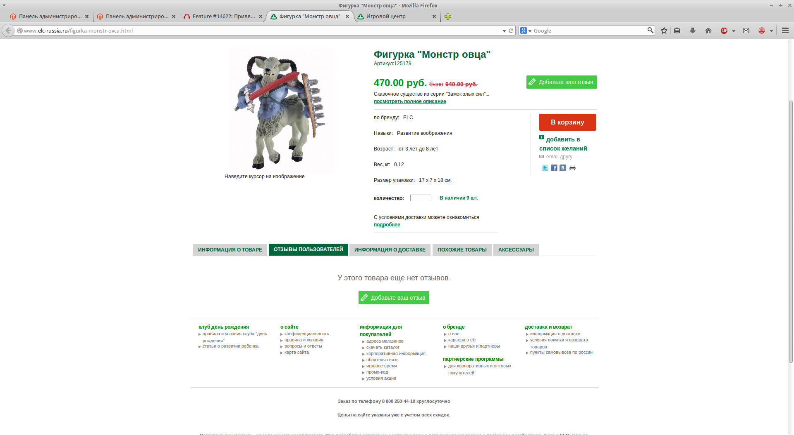
--

--
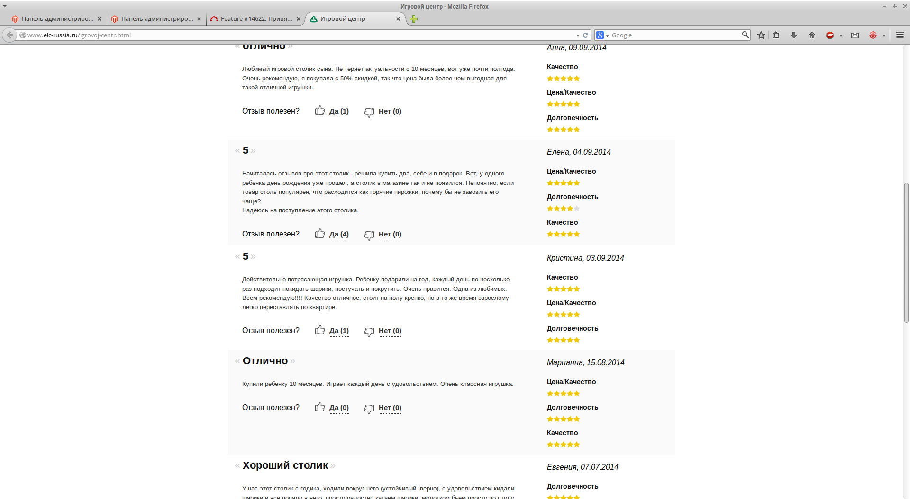
--
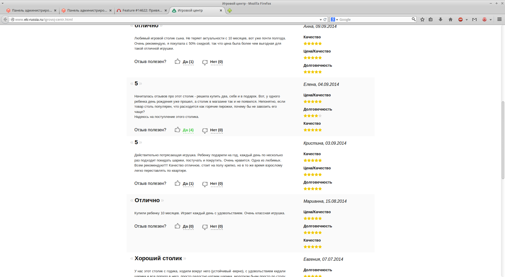
--

--

--

--

--

--
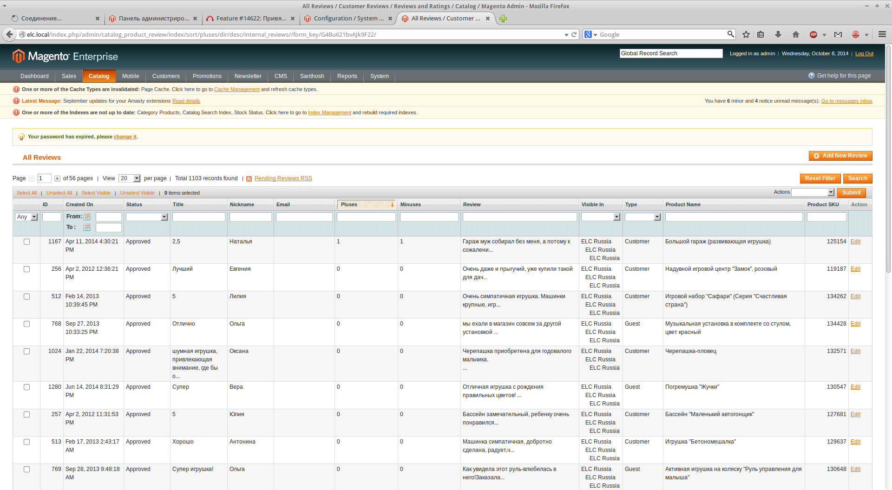
--
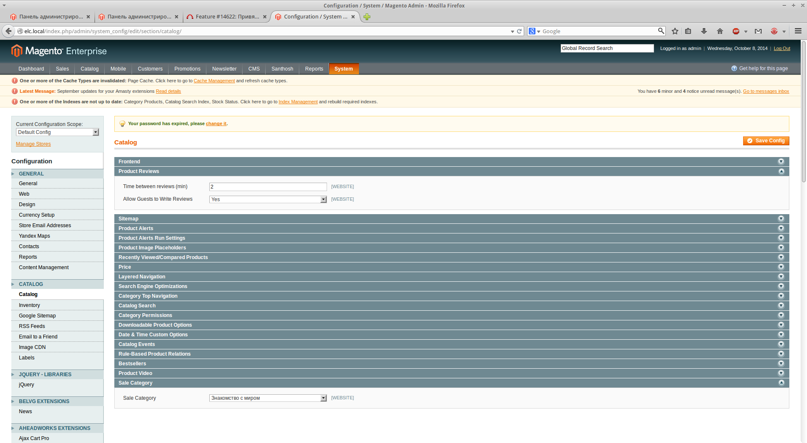
--

--
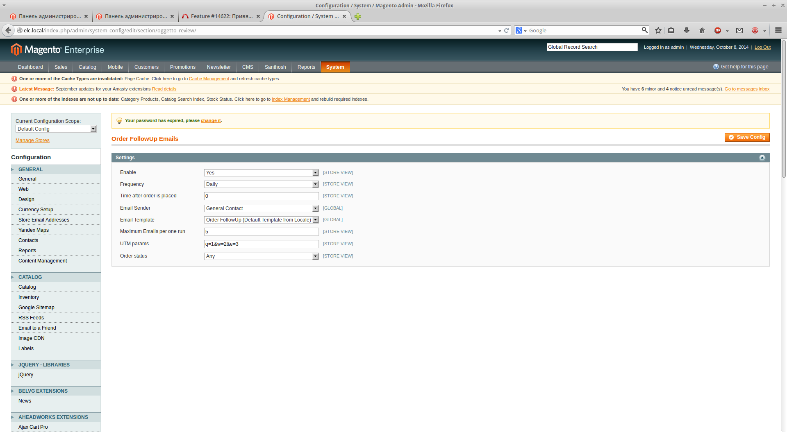
--

--

--

### Блок показа категорий
Модуль предоставляет блок, для показа подкатегорий, из выбранной в админке родительской категории. Возможно встраивание в статичную страницу, например с 404 ошибкой.

--
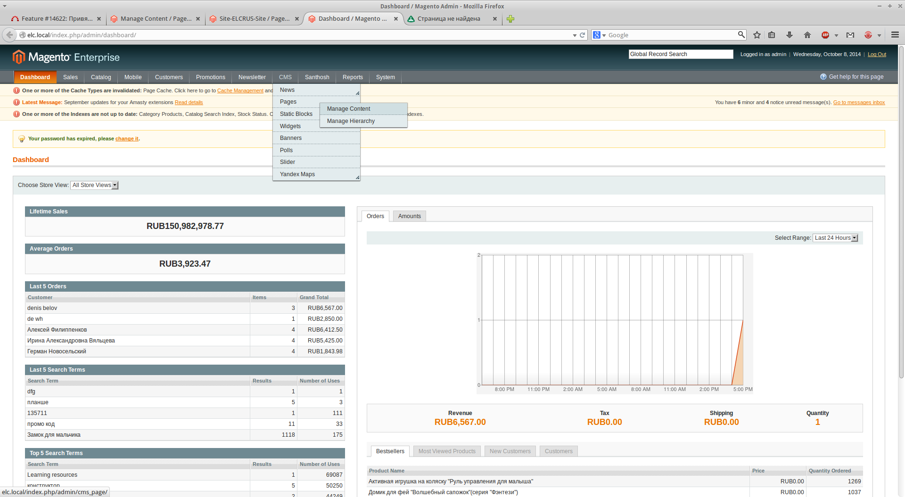
--

--

--
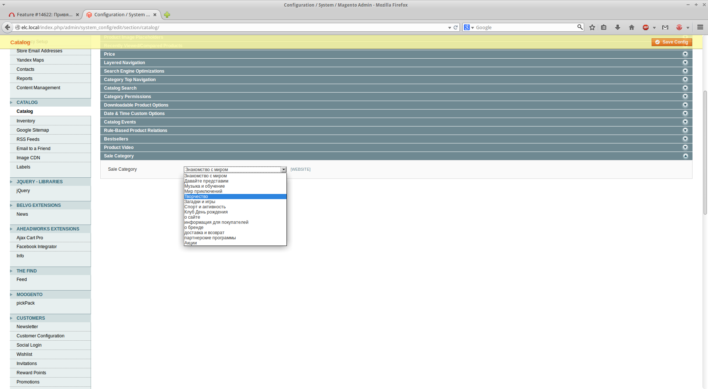
--

--

Спасибо за внимание